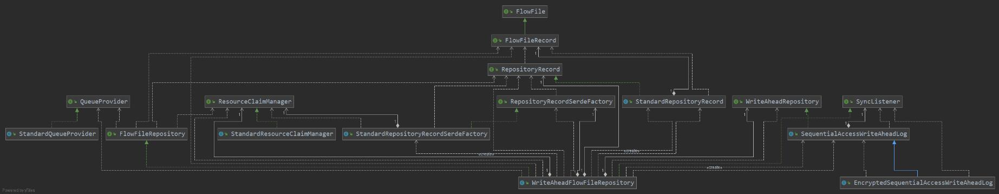

# FlowFile Repository 深入解读

- FlowFile Repository的默认实现为WriteAheadFlowFileRepository，使用WAL(Write-Ahead-Log)记录所有FlowFile对象上的操作。

- WAL支持三种实现形式：
   
   **默认为256个partition**
  
  （1）SequentialAccessWriteAheadLog
    > a. 默认实现
    
    > b. 仅支持配置一个directory，即nifi.properties文件中定义的“nifi.flowfile.repository.directory”

    ``` Java
    wal = new SequentialAccessWriteAheadLog<>(flowFileRepositoryPaths.get(0), serdeFactory, this);
    ```
  
  （2）EncryptedSequentialAccessWriteAheadLog
    > a. 加密版本的SequentialAccessWriteAheadLog
    
    > b. 1.11.0版本（2020.1.22）新发布的特性
  
  （3）MinimalLockingWriteAheadLog
    > a. SequentialAccessWriteAheadLog出现前的默认实现， 出于提高性能的考虑，代码实现为非线程安全，仅支持单线程。
    
    > b. **现已废弃，目前仅用于StateProvider接口实现中。**
    
    > c. 支持配置多个directory，在nifi.properties中以“nifi.flowfile.repository.directory”前缀出现。


## FlowFile Repository领域类图



## 初始化过程

- 初始化如下类成员变量

> 1.ResourceClaimsManager：用于管理ResourceClaim，ResourceClaim中包含了content集合所在的目录信息（id、container以及section）。下面会有专门部分分析ResourceClaim。

> 2.RepositoryRecordSerdeFactory：用于生成WAL中专门用于记录变更的日志接口WriteAheadJournal，WAL的实现机制会有专门的解读。

``` Java
    @Override
    public void initialize(final ResourceClaimManager claimManager) throws IOException {
        initialize(claimManager, new StandardRepositoryRecordSerdeFactory(claimManager));
    }

    public void initialize(final ResourceClaimManager claimManager, final RepositoryRecordSerdeFactory serdeFactory) throws IOException {
        this.claimManager = claimManager;

        for (final File file : flowFileRepositoryPaths) {
            Files.createDirectories(file.toPath());
        }

        // TODO: Should ensure that only 1 instance running and pointing at a particular path
        // TODO: Allow for backup path that can be used if disk out of space?? Would allow a snapshot to be stored on
        // backup and then the data deleted from the normal location; then can move backup to normal location and
        // delete backup. On restore, if no files exist in partition's directory, would have to check backup directory
        this.serdeFactory = serdeFactory;

        // The specified implementation can be plaintext or encrypted; the only difference is the serde factory
        if (isSequentialAccessWAL(walImplementation)) {
            // TODO: May need to instantiate ESAWAL for clarity?
            wal = new SequentialAccessWriteAheadLog<>(flowFileRepositoryPaths.get(0), serdeFactory, this);
        } else if (walImplementation.equals(MINIMAL_LOCKING_WALI)) {
            final SortedSet<Path> paths = flowFileRepositoryPaths.stream()
                    .map(File::toPath)
                    .collect(Collectors.toCollection(TreeSet::new));

            wal = new MinimalLockingWriteAheadLog<>(paths, numPartitions, serdeFactory, this);
        } else {
            throw new IllegalStateException("Cannot create Write-Ahead Log because the configured property '" + WRITE_AHEAD_LOG_IMPL + "' has an invalid value of '" + walImplementation
                    + "'. Please update nifi.properties to indicate a valid value for this property.");
        }

        logger.info("Initialized FlowFile Repository using {} partitions", numPartitions);
    }
```

## 加载FlowFile

- 第一步：从QueueProvider中获取当前画布上所有的FlowFileQueue集合。

``` Java
        final Map<String, FlowFileQueue> queueMap = new HashMap<>();
        for (final FlowFileQueue queue : queueProvider.getAllQueues()) {
            queueMap.put(queue.getIdentifier(), queue);
        }


        public class StandardQueueProvider implements QueueProvider {
            private final FlowManager flowManager;
        
            public StandardQueueProvider(final FlowManager flowManager) {
                this.flowManager = flowManager;
            }
        
        
            @Override
            public Collection<FlowFileQueue> getAllQueues() {
                final Collection<Connection> connections = flowManager.findAllConnections();
                final List<FlowFileQueue> queues = new ArrayList<>(connections.size());
                for (final Connection connection : connections) {
                    queues.add(connection.getFlowFileQueue());
                }
        
                return queues;
            }
        }
```

- 第二步：将第一步中获得的queueMap注入到serdeFactory对象中，WAL能够将serdeFactory对象的queueMap中已swapOut的FlowFile序列化成RepositoryRecord对象，获取并加载外部已物化的swap文件。
  
``` Java
        serdeFactory.setQueueMap(queueMap);

        Collection<RepositoryRecord> recordList = wal.recoverRecords();

        final Set<String> recoveredSwapLocations = wal.getRecoveredSwapLocations();
        synchronized (this.swapLocationSuffixes) {
            recoveredSwapLocations.forEach(loc -> this.swapLocationSuffixes.add(normalizeSwapLocation(loc)));
            logger.debug("Recovered {} Swap Files: {}", swapLocationSuffixes.size(), swapLocationSuffixes);
        }

        if (recordList == null || recordList.isEmpty()) {
            if (isSequentialAccessWAL(walImplementation)) {
                // Configured to use Sequential Access WAL but it has no records. Check if there are records in
                // a MinimalLockingWriteAheadLog that we can recover.
                recordList = migrateFromMinimalLockingLog(wal).orElse(new ArrayList<>());
            } else {
                // Configured to use Minimal Locking WAL but it has no records. Check if there are records in
                // a SequentialAccess Log that we can recover.
                recordList = migrateFromSequentialAccessLog(wal).orElse(new ArrayList<>());
            }
        }

        serdeFactory.setQueueMap(null);
```

- 第三步：为加载的FlowFile对象的ContentClaim对象增加引用计数

``` Java
        for (final RepositoryRecord record : recordList) {
            final ContentClaim claim = record.getCurrentClaim();
            if (claim != null) {
                claimManager.incrementClaimantCount(claim.getResourceClaim());
            }
        }
```

- 第四步：由恢复的FlowFile的sequence number决定全局下一个sequence number，并“丢弃”（不加载）已无对应Queue的FlowFile对象。

``` Java
        int numFlowFilesMissingQueue = 0;
        long maxId = 0;
        for (final RepositoryRecord record : recordList) {
            final long recordId = serdeFactory.getRecordIdentifier(record);
            if (recordId > maxId) {
                maxId = recordId;
            }

            final FlowFileRecord flowFile = record.getCurrent();
            final FlowFileQueue queue = record.getOriginalQueue();
            if (queue == null) {
                numFlowFilesMissingQueue++;
            } else {
                queue.put(flowFile);
            }
        }

        // Set the AtomicLong to 1 more than the max ID so that calls to #getNextFlowFileSequence() will
        // return the appropriate number.
        flowFileSequenceGenerator.set(maxId + 1);
        logger.info("Successfully restored {} FlowFiles and {} Swap Files", recordList.size() - numFlowFilesMissingQueue, recoveredSwapLocations.size());
        if (numFlowFilesMissingQueue > 0) {
            logger.warn("On recovery, found {} FlowFiles whose queue no longer exists. These FlowFiles will be dropped.", numFlowFilesMissingQueue);
        }
```

- 第五步：通知WAL checkpoint，并物化snapshot文件。

``` Java
        final Runnable checkpointRunnable = new Runnable() {
            @Override
            public void run() {
                try {
                    logger.info("Initiating checkpoint of FlowFile Repository");
                    final long start = System.nanoTime();
                    final int numRecordsCheckpointed = checkpoint();
                    final long end = System.nanoTime();
                    final long millis = TimeUnit.MILLISECONDS.convert(end - start, TimeUnit.NANOSECONDS);
                    logger.info("Successfully checkpointed FlowFile Repository with {} records in {} milliseconds", numRecordsCheckpointed, millis);
                } catch (final Throwable t) {
                    logger.error("Unable to checkpoint FlowFile Repository due to " + t.toString(), t);
                }
            }
        };

        checkpointFuture = checkpointExecutor.scheduleWithFixedDelay(checkpointRunnable, checkpointDelayMillis, checkpointDelayMillis, TimeUnit.MILLISECONDS);

        public int checkpoint() throws IOException {
            return wal.checkpoint();
        }

```

## 更新FlowFile Repository

``` Java
    @Override
    public void updateRepository(final Collection<RepositoryRecord> records) throws IOException {
        updateRepository(records, alwaysSync);
    }
```

- 第一步：判断RepositoryRecord合法性

> 如果RepositoryRecord没有目标Connection，且类型又不是DELETE/CONTENTMISSING/CLEANUP_TRANSIENT_CLAIMS的其中一种，则抛出异常。

``` Java
        for (final RepositoryRecord record : records) {
            if (record.getType() != RepositoryRecordType.DELETE && record.getType() != RepositoryRecordType.CONTENTMISSING
                    && record.getType() != RepositoryRecordType.CLEANUP_TRANSIENT_CLAIMS && record.getDestination() == null) {
                throw new IllegalArgumentException("Record " + record + " has no destination and Type is " + record.getType());
            }
        }
```

- 第二步：将需要/不需要序列化的FlowFile分离出来，只挑出需要序列化的FlowFile。

``` Java
        // Partition records by whether or not their type is 'CLEANUP_TRANSIENT_CLAIMS'. We do this because we don't want to send
        // these types of records to the Write-Ahead Log.
        final Map<Boolean, List<RepositoryRecord>> partitionedRecords = records.stream()
                .collect(Collectors.partitioningBy(record -> record.getType() == RepositoryRecordType.CLEANUP_TRANSIENT_CLAIMS));

        List<RepositoryRecord> recordsForWal = partitionedRecords.get(Boolean.FALSE);
        if (recordsForWal == null) {
            recordsForWal = Collections.emptyList();
        }
```

- 第三步：更新WAL

> 此处细节，我们在解读SequentialAccessWriteAheadLog再详细说明。

``` Java
        // update the repository.
        final int partitionIndex = wal.update(recordsForWal, sync);
```

- 第四步：ResourceClaim更新触发联动的ContentClaim更新

``` Java
        updateContentClaims(records, partitionIndex);
```

1. 首先说明下ResourceClaim与ContentClaim的关系

> ResourceClaim是NiFi对于Repository中资源的一种抽象，主要包含id、container和section这几个属性，container是定义在nifi.properties中以"nifi.content.repository.directory."为前缀的配置项，可以配置多个，即Content Repository中的一级目录；section可以看作是container的二级子目录，默认每个container中有1024个section。

> ResourceClaim是ContentClaim的超集，ContentClaim包含offset和length两个重要属性，ContentClaim对象为所在的ResourceClaim对象中offset起始位，偏移length长度的二进制字节对象。

2. 更新ContentClaim的引用计数。RepositoryRecord对象里持有当前引用的ContentClaim对象currentClaim和原始ContentClaim对象originalClaim。

> （1）如果FlowFile为DELETE/CONTENTMISSING，则减少currentClaim对象的引用计数；

> （2）如果currentClaim对象与originalClaim对象两者不相等，则认为FlowFile的content已被更新，减少originalClaim的引用计数。

``` Java
    private void updateClaimCounts(final RepositoryRecord record) {
        final ContentClaim currentClaim = record.getCurrentClaim();
        final ContentClaim originalClaim = record.getOriginalClaim();
        final boolean claimChanged = !Objects.equals(currentClaim, originalClaim);

        if (record.getType() == RepositoryRecordType.DELETE || record.getType() == RepositoryRecordType.CONTENTMISSING) {
            decrementClaimCount(currentClaim);
        }

        if (claimChanged) {
            // records which have been updated - remove original if exists
            decrementClaimCount(originalClaim);
        }
    }
```

3. 收集以下几种待destruction的ResourceClaim对象，并收集待SwapIn和SwapOut的swap文件名。

> （1）DELETE状态的RepositoryRecord的currentClaim，以及和currentClaim对象不同的originalClaim

> （2）UPDATE状态的RepositoryRecord的originalClaim

``` Java
        final Set<ResourceClaim> claimsToAdd = new HashSet<>();

        final Set<String> swapLocationsAdded = new HashSet<>();
        final Set<String> swapLocationsRemoved = new HashSet<>();

        for (final RepositoryRecord record : repositoryRecords) {
            updateClaimCounts(record);

            if (record.getType() == RepositoryRecordType.DELETE) {
                // For any DELETE record that we have, if claim is destructible, mark it so
                if (record.getCurrentClaim() != null && isDestructable(record.getCurrentClaim())) {
                    claimsToAdd.add(record.getCurrentClaim().getResourceClaim());
                }

                // If the original claim is different than the current claim and the original claim is destructible, mark it so
                if (record.getOriginalClaim() != null && !record.getOriginalClaim().equals(record.getCurrentClaim()) && isDestructable(record.getOriginalClaim())) {
                    claimsToAdd.add(record.getOriginalClaim().getResourceClaim());
                }
            } else if (record.getType() == RepositoryRecordType.UPDATE) {
                // if we have an update, and the original is no longer needed, mark original as destructible
                if (record.getOriginalClaim() != null && record.getCurrentClaim() != record.getOriginalClaim() && isDestructable(record.getOriginalClaim())) {
                    claimsToAdd.add(record.getOriginalClaim().getResourceClaim());
                }
            } else if (record.getType() == RepositoryRecordType.SWAP_OUT) {
                final String swapLocation = record.getSwapLocation();
                swapLocationsAdded.add(swapLocation);
                swapLocationsRemoved.remove(swapLocation);
            } else if (record.getType() == RepositoryRecordType.SWAP_IN) {
                final String swapLocation = record.getSwapLocation();
                swapLocationsRemoved.add(swapLocation);
                swapLocationsAdded.remove(swapLocation);
            }
        }
```

4. 将transient类型的ContentClaim添加到destruction集合中

``` Java
        for (final RepositoryRecord record : repositoryRecords) {
            final List<ContentClaim> transientClaims = record.getTransientClaims();
            if (transientClaims != null) {
                for (final ContentClaim transientClaim : transientClaims) {
                    if (isDestructable(transientClaim)) {
                        claimsToAdd.add(transientClaim.getResourceClaim());
                    }
                }
            }
        }
```

5. 根据收集待SwapIn和SwapOut的swap文件名，更新全局的swap文件名集合

``` Java
        if (!swapLocationsAdded.isEmpty() || !swapLocationsRemoved.isEmpty()) {
            synchronized (swapLocationSuffixes) {
                swapLocationsRemoved.forEach(loc -> swapLocationSuffixes.remove(normalizeSwapLocation(loc)));
                swapLocationsAdded.forEach(loc -> swapLocationSuffixes.add(normalizeSwapLocation(loc)));
            }
        }
```

6. 将收集到的待destruction的ResourceClaim对象集合按照分区ID，添加到全局的待destruction的阻塞队列中

``` Java
        private final ConcurrentMap<Integer, BlockingQueue<ResourceClaim>> claimsAwaitingDestruction = new ConcurrentHashMap<>();

        if (!claimsToAdd.isEmpty()) {
            // Get / Register a Set<ContentClaim> for the given Partiton Index
            final Integer partitionKey = Integer.valueOf(partitionIndex);
            BlockingQueue<ResourceClaim> claimQueue = claimsAwaitingDestruction.get(partitionKey);
            if (claimQueue == null) {
                claimQueue = new LinkedBlockingQueue<>();
                final BlockingQueue<ResourceClaim> existingClaimQueue = claimsAwaitingDestruction.putIfAbsent(partitionKey, claimQueue);
                if (existingClaimQueue != null) {
                    claimQueue = existingClaimQueue;
                }
            }

            claimQueue.addAll(claimsToAdd);
        }
```

## 分区sync和全局sync

- 通知ResourceClaimManager对象，将分区对应的or所有分区中待destruction的ResourceClaim集合标记清除，清除策略具体由Content Repository控制。

- 标记清除，可以防止突然crash或者掉电后出现数据不一致的情况。

``` Java
    @Override
    public void onSync(final int partitionIndex) {
        final BlockingQueue<ResourceClaim> claimQueue = claimsAwaitingDestruction.get(partitionIndex);
        if (claimQueue == null) {
            return;
        }

        final Set<ResourceClaim> claimsToDestroy = new HashSet<>();
        claimQueue.drainTo(claimsToDestroy);

        for (final ResourceClaim claim : claimsToDestroy) {
            markDestructable(claim);
        }
    }

    @Override
    public void onGlobalSync() {
        for (final BlockingQueue<ResourceClaim> claimQueue : claimsAwaitingDestruction.values()) {
            final Set<ResourceClaim> claimsToDestroy = new HashSet<>();
            claimQueue.drainTo(claimsToDestroy);

            for (final ResourceClaim claim : claimsToDestroy) {
                markDestructable(claim);
            }
        }
    }

    private void markDestructable(final ResourceClaim resourceClaim) {
        if (resourceClaim == null) {
            return;
        }

        claimManager.markDestructable(resourceClaim);
    }
```

## swapIn FlowFile

- 我们知道，FlowFile对象真正从磁盘上交换到内存中，是当SwappablePriorityQueue中swapQueue队列大小**小于**SWAP_RECORD_POLL_SIZE阈值（不可配置，默认1w）时发生的。FlowFile Repository中的swapIn操作，仅仅是设置待SwapIn的FlowFile的swap文件名以及目标队列，并通知WAL记录本次SwapIn动作。

- 特别的，我们注意到调用更新动作updateRepository时，sync=true，即WAL会将记录立即flush到磁盘对应的文件中。

``` Java
    @Override
    public void swapFlowFilesIn(final String swapLocation, final List<FlowFileRecord> swapRecords, final FlowFileQueue queue) throws IOException {
        final List<RepositoryRecord> repoRecords = new ArrayList<>();

        for (final FlowFileRecord swapRecord : swapRecords) {
            final StandardRepositoryRecord repoRecord = new StandardRepositoryRecord(queue, swapRecord);
            repoRecord.setSwapLocation(swapLocation);   // set the swap file to indicate that it's being swapped in.
            repoRecord.setDestination(queue);

            repoRecords.add(repoRecord);
        }

        updateRepository(repoRecords, true);

        synchronized (this.swapLocationSuffixes) {
            this.swapLocationSuffixes.remove(normalizeSwapLocation(swapLocation));
        }

        logger.info("Repository updated to reflect that {} FlowFiles were swapped in to {}", new Object[]{swapRecords.size(), queue});
    }
```

## swapOut FlowFile

- 我们知道，FlowFile对象真正被swap到磁盘上，是当SwappablePriorityQueue中swapQueue队列大小**超过**SWAP_RECORD_POLL_SIZE阈值（不可配置，默认1w）时发生的。FlowFile Repository中的swapOut操作，仅仅是将swap文件名记录下来，并通知WAL记录本次swapOut动作。

``` Java
    /**
     * Swaps the FlowFiles that live on the given Connection out to disk, using
     * the specified Swap File and returns the number of FlowFiles that were
     * persisted.
     *
     * @param queue        queue to swap out
     * @param swapLocation location to swap to
     * @throws IOException ioe
     */
    @Override
    public void swapFlowFilesOut(final List<FlowFileRecord> swappedOut, final FlowFileQueue queue, final String swapLocation) throws IOException {
        final List<RepositoryRecord> repoRecords = new ArrayList<>();
        if (swappedOut == null || swappedOut.isEmpty()) {
            return;
        }

        for (final FlowFileRecord swapRecord : swappedOut) {
            final RepositoryRecord repoRecord = new StandardRepositoryRecord(queue, swapRecord, swapLocation);
            repoRecords.add(repoRecord);
        }

        // TODO: We should probably update this to support bulk 'SWAP OUT' records. As-is, we have to write out a
        // 'SWAP OUT' record for each FlowFile, which includes the Update Type, FlowFile ID, swap file location, and Queue ID.
        // We could instead have a single record with Update Type of 'SWAP OUT' and just include swap file location, Queue ID,
        // and all FlowFile ID's.
        // update WALI to indicate that the records were swapped out.
        wal.update(repoRecords, true);

        synchronized (this.swapLocationSuffixes) {
            this.swapLocationSuffixes.add(normalizeSwapLocation(swapLocation));
        }

        logger.info("Successfully swapped out {} FlowFiles from {} to Swap File {}", swappedOut.size(), queue, swapLocation);
    }

```
