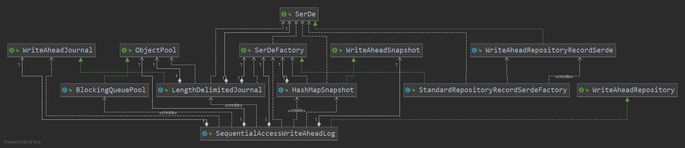

# FlowFileRepository中WriteAheadLog实现解读

## WriteAheadLog领域类图


## WriteAheadRepository接口

>1. WriteAheadRepository记录发生在每一个FlowFile对象上的操作，这样在重启时，FlowFileRepository可以通过回放快照从而恢复关闭前所有FlowFile的状态。
>2. 不提供任何查询功能，只用于NiFi重启时恢复关闭前的快照。
>3. 但是，无限制的记录所有操作存在两个缺陷：（1）会占用大量的磁盘空间；（2）重启回放数据过程会非常耗时。所以WriteAheadRepository接口提供了checkpoint机制。
>4. 在checkpoint周期内，FlowFileRepository通过写journal日志文件记录下当前所有FlowFile的操作；当到达checkpoint时间点时，将当前所有FlowFile对象状态flush到磁盘，成为checkpoint文件，并删除checkpoint周期内所写的journal日志文件。
>5. 当NiFi重启时，首先回放checkpoint对应的checkpoint文件，再回放增量的journal，从而恢复关闭前内存中所有FlowFile的状态。

- 总结

>1. 在checkpoint机制中，checkpoint文件记录的是当前checkpoint时间点下全局快照，是一个瞬态；journal文件记录的是checkpoint周期内发生的所有增量操作，是一个时间段内的连续操作。
>2. checkpoint时间周期默认为2分钟。周期内，FlowFileRepository会将所有FlowFile的操作记录写入到journal日志文件中，根据某特定类型数据的相关情况，2分钟物化的journal日志大约4.1G。并且，checkpoint时会发生强制flush journal日志文件、prepareSnapshot、生成新的journal日志文件这种类似STW的现象。同时，过大的checkpoint周期，在NiFi重启恢复时，需要读取的checkpoint文件与journal文件也过大。所以综上，不建议设置过大的checkpoint周期，建议保持默认2分钟。

## 默认实现SequentialAccessWriteAheadLog

### 实现特点

#### 1. 顺序写，journal文件有且仅有一个（sequentially by writing to a single journal file）

- journal目录为FlowFileRepository的“journals”子目录，journal文件名特征：**${当前journal文件中最小事务ID}.journal**

#### 2. 循环写，减少GC。理论上可达到磁盘的顺序写IO速率

- NiFi构造了BlockingQueuePool这种数据结构来实现循环覆盖写。

    ``` Java
        private final ObjectPool<ByteArrayDataOutputStream> streamPool = new BlockingQueuePool<>(MAX_BUFFERS,
        () -> new ByteArrayDataOutputStream(BUFFER_SIZE),
        stream -> stream.getByteArrayOutputStream().size() < BUFFER_SIZE,
        stream -> stream.getByteArrayOutputStream().reset());

        public class BlockingQueuePool<T> implements ObjectPool<T> {
        private final BlockingQueue<T> queue;
        private final Supplier<T> creationFunction;
        private final Predicate<T> reuseCheck;
        private final Consumer<T> returnPreparation;

        public BlockingQueuePool(final int maxSize, final Supplier<T> creationFunction, final Predicate<T> reuseCheck, final Consumer<T> returnPreparation) {
            this.queue = new LinkedBlockingQueue<>(maxSize);
            this.creationFunction = creationFunction;
            this.reuseCheck = reuseCheck;
            this.returnPreparation = returnPreparation;
        }

        @Override
        public T borrowObject() {
            final T existing = queue.poll();
            if (existing != null) {
                return existing;
            }

            return creationFunction.get();
        }

        @Override
        public void returnObject(final T somethingBorrowed) {
            if (reuseCheck.test(somethingBorrowed)) {
                returnPreparation.accept(somethingBorrowed);
                queue.offer(somethingBorrowed);
            }
        }
    }
    ```

1. 阻塞队列LinkedBlockingQueue：存放对象为ByteArrayDataOutputStream，每个ByteArrayDataOutputStream对象，初始化大小BUFFER_SIZE(256KB)；LinkedBlockingQueue中最多可存放MAX_BUFFERS(64)个ByteArrayDataOutputStream对象。

2. creationFunction：当阻塞队列为空时，创建初始化大小为BUFFER_SIZE(256KB)的ByteArrayDataOutputStream对象。

3. reuseCheck：当ByteArrayDataOutputStream对象满足ByteArrayDataOutputStream::size() < BUFFER_SIZE时，可被重用。

4. returnPreparation：可被重用时，先ByteArrayDataOutputStream::reset，再插入到阻塞队列LinkedBlockingQueue中。

### Journal日志文件结构

``` schema
Header:
    LengthDelimitedJournal::className
    LengthDelimitedJournal::JOURNAL_ENCODING_VERSION(1)
    SchemaRepositoryRecordSerde::className
    SchemaRepositoryRecordSerde::MAX_ENCODING_VERSION(2)
    Length of REPOSITORY_RECORD_SCHEMA_V2
    REPOSITORY_RECORD_SCHEMA_V2:
        REPOSITORY_RECORD_UPDATE_V2("Repository Record Update", 1)
            CREATE_OR_UPDATE_ACTION("Create or Update", 1)
                ACTION_TYPE("Action", String, 1)
                FLOWFILE_SCHEMA_V2(参见swap文件中FULL_SWAP_FILE_SCHEMA_V2.FLOWFILE_CONTENTS部分)
                QUEUE_IDENTIFIER("Queue Identifier", String, 1)
                SWAP_LOCATION("Swap Location", String, 0|1)
            DELETE_ACTION("Delete", 1)
                ACTION_TYPE_FIELD
                    ACTION_TYPE("Action", String, 1)
                RECORD_ID_FIELD
                    RECORD_ID("Record ID", Long, 1)
            SWAP_OUT_ACTION("Swap Out", 1)
                ACTION_TYPE_FIELD
                    ACTION_TYPE("Action", String, 1)
                RECORD_ID_FIELD
                    RECORD_ID("Record ID", Long, 1)
                QUEUE_IDENTIFIER("Queue Identifier", String, 1)
                SWAP_LOCATION("Swap Location", String, 0|1)
            SWAP_IN_ACTION("Swap In", 1)
                SWAP_LOCATION("Swap Location", String ,1)
Update:
    Content of RepositoryRecord(写入内容具体参见：WriteAheadRepositoryRecordSerde::serializeEdit)
    TRANSACTION_FOLLOWS(64)
    transactionId
    length of bytes
```

### checkpoint文件结构

``` schema
HashMapSnapshot::className
HashMapSnapshot::ENCODING_VERSION(1)
SchemaRepositoryRecordSerde::className
SchemaRepositoryRecordSerde::MAX_ENCODING_VERSION(2)
MaxTransactionId
Number of RepositoryRecord
REPOSITORY_RECORD_SCHEMA_V2:
    REPOSITORY_RECORD_UPDATE_V2("Repository Record Update", 1)
        CREATE_OR_UPDATE_ACTION("Create or Update", 1)
            ACTION_TYPE("Action", String, 1)
            FLOWFILE_SCHEMA_V2(参见swap文件中FULL_SWAP_FILE_SCHEMA_V2.FLOWFILE_CONTENTS部分)
            QUEUE_IDENTIFIER("Queue Identifier", String, 1)
            SWAP_LOCATION("Swap Location", String, 0|1)
        DELETE_ACTION("Delete", 1)
            ACTION_TYPE_FIELD
                ACTION_TYPE("Action", String, 1)
            RECORD_ID_FIELD
                RECORD_ID("Record ID", Long, 1)
        SWAP_OUT_ACTION("Swap Out", 1)
            ACTION_TYPE_FIELD
                ACTION_TYPE("Action", String, 1)
            RECORD_ID_FIELD
                RECORD_ID("Record ID", Long, 1)
            QUEUE_IDENTIFIER("Queue Identifier", String, 1)
            SWAP_LOCATION("Swap Location", String, 0|1)
        SWAP_IN_ACTION("Swap In", 1)
            SWAP_LOCATION("Swap Location", String ,1)
Content of RepositoryRecord(写入内容具体参见：WriteAheadRepositoryRecordSerde::serializeEdit)
Number of swapLocation
Content of swapLocation
```

特别的，写REPOSITORY_RECORD_SCHEMA_V2部分时，首先写入所有Field的总数，再依次写入所有Field。其中，一个Field包含四部分：Field Name, Field Type, Field Repetition, Sub-Fields，写Sub-Fields时，首先写入Sub-Fields的数量，再按照Field的字段顺序依次递归写入。具体可以参见RecordField及其派生类SimpleRecordField、MapRecordField、ComplexRecordField、UnionRecordField。

### 更新操作

- 第一步：获取journal日志文件读锁，更新journal日志文件。

    ``` Java
    journalReadLock.lock();
    try {
        journal.update(records, recordLookup);
        ...
    }
    ```

- 其中，WriteAheadJournal接口默认实现类LengthDelimitedJournal。更新journal日志文件主要分成以下几个步骤：
   1. 检查待写入的journal文件状态。
   （1）文件头是否被写入：文件头是在checkpoint期间生成新的journal文件时写入的，具体格式可参见journal日志文件的schema。
   （2）文件头写入过程中是否发生异常、文件是否已关闭。

    ``` Java
    @Override
    public void update(final Collection<T> records, final RecordLookup<T> recordLookup) throws IOException {
        if (!headerWritten) {
            throw new IllegalStateException("Cannot update journal file " + journalFile + " because no header has been written yet.");
        }

        if (records.isEmpty()) {
            return;
        }

        checkState();
        ...
    }
    ```

   2. 从我们上文提到的可重用的BlockingQueuePool中获取输出流，对于需要update的RepositoryRecord，一一写入以下信息：
   （1）RepositoryRecord的previous状态（实际写时是被忽略的）和current状态，根据RepositoryRecordType的类型，生成不同的schema（定义在RepositoryRecordSchema类中）。
   （2）当输出流内存大小超过DEFAULT_MAX_IN_HEAP_SERIALIZATION_BYTES（5MB）时，将输出流中的内容写入到overflow-开头的文件中。

    ```Java
    @Override
    public void update(final Collection<T> records, final RecordLookup<T> recordLookup) throws IOException {
        ...
        File overflowFile = null;
        final ByteArrayDataOutputStream bados = streamPool.borrowObject();

        try {
            FileOutputStream overflowFileOut = null;

            try {
                DataOutputStream dataOut = bados.getDataOutputStream();
                for (final T record : records) {
                    final Object recordId = serde.getRecordIdentifier(record);
                    final T previousRecordState = recordLookup.lookup(recordId);
                    serde.serializeEdit(previousRecordState, record, dataOut);

                    final int size = bados.getByteArrayOutputStream().size();
                    if (serde.isWriteExternalFileReferenceSupported() && size > maxInHeapSerializationBytes) {
                        if (!overflowDirectory.exists()) {
                            createOverflowDirectory(overflowDirectory.toPath());
                        }

                        // If we have exceeded our threshold for how much to serialize in memory,
                        // flush the in-memory representation to an 'overflow file' and then update
                        // the Data Output Stream that is used to write to the file also.
                        overflowFile = new File(overflowDirectory, UUID.randomUUID().toString());
                        logger.debug("Length of update with {} records exceeds in-memory max of {} bytes. Overflowing to {}", records.size(), maxInHeapSerializationBytes, overflowFile);

                        overflowFileOut = new FileOutputStream(overflowFile);
                        bados.getByteArrayOutputStream().writeTo(overflowFileOut);
                        bados.getByteArrayOutputStream().reset();

                        // change dataOut to point to the File's Output Stream so that all subsequent records are written to the file.
                        dataOut = new DataOutputStream(new BufferedOutputStream(overflowFileOut));

                        // We now need to write to the ByteArrayOutputStream a pointer to the overflow file
                        // so that what is written to the actual journal is that pointer.
                        serde.writeExternalFileReference(overflowFile, bados.getDataOutputStream());
                    }
                }

                dataOut.flush();

                // If we overflowed to an external file, we need to be sure that we sync to disk before
                // updating the Journal. Otherwise, we could get to a state where the Journal was flushed to disk without the
                // external file being flushed. This would result in a missed update to the FlowFile Repository.
                if (overflowFileOut != null) {
                    if (logger.isDebugEnabled()) { // avoid calling File.length() if not necessary
                        logger.debug("Length of update to overflow file is {} bytes", overflowFile.length());
                    }

                    overflowFileOut.getFD().sync();
                }
            } finally {
                if (overflowFileOut != null) {
                    try {
                        overflowFileOut.close();
                    } catch (final Exception e) {
                        logger.warn("Failed to close open file handle to overflow file {}", overflowFile, e);
                    }
                }
            }
        ...
    }
    ```

    3. 加锁自增事务id，并将事务ID、事务分隔符TRANSACTION_FOLLOWS、流字节数写入到journal日志文件中。

    ``` Java
    @Override
    public void update(final Collection<T> records, final RecordLookup<T> recordLookup) throws IOException {
        ...
        final ByteArrayOutputStream baos = bados.getByteArrayOutputStream();
            final OutputStream out = getOutputStream();

            final long transactionId;
            synchronized (this) {
                checkState();

                try {
                    transactionId = currentTransactionId++;
                    transactionCount++;

                    transactionPreamble.clear();
                    transactionPreamble.putLong(transactionId);
                    transactionPreamble.putInt(baos.size());

                    out.write(TRANSACTION_FOLLOWS);
                    out.write(transactionPreamble.array());
                    baos.writeTo(out);
                    out.flush();
                } catch (final Throwable t) {
                    // While the outter Throwable that wraps this "catch" will call Poison, it is imperative that we call poison()
                    // before the synchronized block is excited. Otherwise, another thread could potentially corrupt the journal before
                    // the poison method closes the file.
                    poison(t);
                    throw t;
                }
            }
        ...
    }
    ```

- 第二步：如果强制同步forceSync=true，则强制将日志内容flush到磁盘上，并返回onSync分区（一个分区，所以默认为0）

``` Java
    if (forceSync) {
        journal.fsync();
        syncListener.onSync(PARTITION_INDEX);
    }
```

- 第三步：联动更新checkpoint内容

``` Java
    snapshot.update(records);
```

- 其中，WriteAheadSnapshot的默认实现为HashMapSnapshot。HashMapSnapshot类中通过ConcurrentHashMap持有当前所有存活（指没有被removed、没有被swapout）的FlowFile，key为FlowFile的ID。这样可以加速checkpoint过程，而不需要在checkpoint时还需要去读取journal日志内容。
- **风险点：内存中过多的FlowFile会引发OOM**

1. 移除delete类型FlowFile
2. 移除swapout类型FlowFile，并记录对应的swap文件名
3. 添加swapin类型FlowFile，并移除对应的swap文件名
4. 添加其他类型的FlowFile

``` Java
    @Override
    public void update(final Collection<T> records) {
        // This implementation of Snapshot keeps a ConcurrentHashMap of all 'active' records
        // (meaning records that have not been removed and are not swapped out), keyed by the
        // Record Identifier. It keeps only the most up-to-date version of the Record. This allows
        // us to write the snapshot very quickly without having to re-process the journal files.
        // For each update, then, we will update the record in the map.
        for (final T record : records) {
            final Object recordId = serdeFactory.getRecordIdentifier(record);
            final UpdateType updateType = serdeFactory.getUpdateType(record);

            switch (updateType) {
                case DELETE:
                    recordMap.remove(recordId);
                    break;
                case SWAP_OUT:
                    final String location = serdeFactory.getLocation(record);
                    if (location == null) {
                        logger.error("Received Record (ID=" + recordId + ") with UpdateType of SWAP_OUT but "
                            + "no indicator of where the Record is to be Swapped Out to; these records may be "
                            + "lost when the repository is restored!");
                    } else {
                        recordMap.remove(recordId);
                        this.swapLocations.add(location);
                    }
                    break;
                case SWAP_IN:
                    final String swapLocation = serdeFactory.getLocation(record);
                    if (swapLocation == null) {
                        logger.error("Received Record (ID=" + recordId + ") with UpdateType of SWAP_IN but no "
                            + "indicator of where the Record is to be Swapped In from; these records may be duplicated "
                            + "when the repository is restored!");
                    } else {
                        swapLocations.remove(swapLocation);
                    }
                    recordMap.put(recordId, record);
                    break;
                default:
                    recordMap.put(recordId, record);
                    break;
            }
        }
    }
```

- 第四步：释放journal日志文件读锁，返回默认分区号0

### 定期checkpoint

- 第一步：获取journal日志文件的写锁。根据LengthDelimitedJournal::getSummary获取当前journal日志的summary信息（最小事务ID、最大事务ID、事务总数），如果事务总数为0且journal文件healthy（输入输出流未关闭、输入输出过程中发生异常），则认为该周期内没有发生需要checkpoint的任何增量操作，直接退出本次checkpoint。否则，将journal日志的FileOutputStream中内容强制flush到磁盘上。最后在journal日志文件中写入JOURNAL_COMPLETE（127），并关闭文件。设置下一个事务ID。
  
    ``` Java
    if (journal != null) {
        final JournalSummary journalSummary = journal.getSummary();
        if (journalSummary.getTransactionCount() == 0 && journal.isHealthy()) {
            logger.debug("Will not checkpoint Write-Ahead Log because no updates have occurred since last checkpoint");
            return snapshot.getRecordCount();
        }

        try {
            journal.fsync();
        } catch (final Exception e) {
            logger.error("Failed to synch Write-Ahead Log's journal to disk at {}", storageDirectory, e);
        }

        try {
            journal.close();
        } catch (final Exception e) {
            logger.error("Failed to close Journal while attempting to checkpoint Write-Ahead Log at {}", storageDirectory);
        }

        nextTransactionId = Math.max(nextTransactionId, journalSummary.getLastTransactionId() + 1);
    }
    ```

- 第二步：首先收集所有待销毁的journal文件对象，**根据已关闭的journal日志文件信息（下一个事务ID、swap文件路径）创建checkpoint时需要的Snapshot对象（包括本次所有RepositoryRecord、最大事务ID、所有swap文件名）**，创建一个新的journal文件，并检测该文件对象是否存在，如果存在，则自增事务ID，重新创建journal文件。重新创建LengthDelimitedJournal对象，指向新生成的journal文件，写入journal文件首部。并释放写锁。

    ``` Java
    journalWriteLock.lock();
        try {
            ...
            syncListener.onGlobalSync();

            final File[] existingFiles = journalsDirectory.listFiles(this::isJournalFile);
            existingJournals = (existingFiles == null) ? new File[0] : existingFiles;

            if (swapLocations == null) {
                snapshotCapture = snapshot.prepareSnapshot(nextTransactionId - 1);
            } else {
                snapshotCapture = snapshot.prepareSnapshot(nextTransactionId - 1, swapLocations);
            }


            // Create a new journal. We name the journal file <next transaction id>.journal but it is possible
            // that we could have an empty journal file already created. If this happens, we don't want to create
            // a new file on top of it because it would get deleted below when we clean up old journals. So we
            // will simply increment our transaction ID and try again.
            File journalFile = new File(journalsDirectory, nextTransactionId + ".journal");
            while (journalFile.exists()) {
                nextTransactionId++;
                journalFile = new File(journalsDirectory, nextTransactionId + ".journal");
            }

            journal = new LengthDelimitedJournal<>(journalFile, serdeFactory, streamPool, nextTransactionId);
            journal.writeHeader();

            logger.debug("Created new Journal starting with Transaction ID {}", nextTransactionId);
        } finally {
            journalWriteLock.unlock();
        }
    ```

- 第三步： 生成checkpoint文件。我们主要看下HashMapSnapshot::writeSnapshot方法。
（1）如果只存在"checkpoint.partial"文件，根据后续逻辑可知"checkpoint.partial"文件只要生成了就是完整内容，没有"checkpoint"文件说明上次checkpoint期间删除"checkpoint"文件到rename操作间发生了crash/died，所以直接rename成"checkpoint"文件即可。
（2）先在内存中写"checkpoint.partial"文件，写入的内容如上述的**checkpoint的schema**，再一次性flush到磁盘上。保证"checkpoint.partial"文件只要生成了就是完整的内容。再删除原“checkpoint”文件，最后将"checkpoint.partial"文件rename成“checkpoint”文件。

    ``` Java
    @Override
    public synchronized void writeSnapshot(final SnapshotCapture<T> snapshot) throws IOException {
        final SerDe<T> serde = serdeFactory.createSerDe(null);

        final File snapshotFile = getSnapshotFile();
        final File partialFile = getPartialFile();

        // We must ensure that we do not overwrite the existing Snapshot file directly because if NiFi were
        // to be killed or crash when we are partially finished, we'd end up with no viable Snapshot file at all.
        // To avoid this, we write to a 'partial' file, then delete the existing Snapshot file, if it exists, and
        // rename 'partial' to Snaphsot. That way, if NiFi crashes, we can still restore the Snapshot by first looking
        // for a Snapshot file and restoring it, if it exists. If it does not exist, then we restore from the partial file,
        // assuming that NiFi crashed after deleting the Snapshot file and before renaming the partial file.
        //
        // If there is no Snapshot file currently but there is a Partial File, then this indicates
        // that we have deleted the Snapshot file and failed to rename the Partial File. We don't want
        // to overwrite the Partial file, because doing so could potentially lose data. Instead, we must
        // first rename it to Snapshot and then write to the partial file.
        if (!snapshotFile.exists() && partialFile.exists()) {
            final boolean rename = partialFile.renameTo(snapshotFile);
            if (!rename) {
                throw new IOException("Failed to rename partial snapshot file " + partialFile + " to " + snapshotFile);
            }
        }

        // Write to the partial file.
        try (final FileOutputStream fileOut = new FileOutputStream(getPartialFile());
            final OutputStream bufferedOut = new BufferedOutputStream(fileOut);
            final DataOutputStream dataOut = new DataOutputStream(bufferedOut)) {

            // Write out the header
            dataOut.writeUTF(HashMapSnapshot.class.getName());
            dataOut.writeInt(getVersion());
            dataOut.writeUTF(serde.getClass().getName());
            dataOut.writeInt(serde.getVersion());
            dataOut.writeLong(snapshot.getMaxTransactionId());
            dataOut.writeInt(snapshot.getRecords().size());
            serde.writeHeader(dataOut);

            // Serialize each record
            for (final T record : snapshot.getRecords().values()) {
                logger.trace("Checkpointing {}", record);
                serde.serializeRecord(record, dataOut);
            }

            // Write out the number of swap locations, followed by the swap locations themselves.
            dataOut.writeInt(snapshot.getSwapLocations().size());
            for (final String swapLocation : snapshot.getSwapLocations()) {
                dataOut.writeUTF(swapLocation);
            }

            // Ensure that we flush the Buffered Output Stream and then perform an fsync().
            // This ensures that the data is fully written to disk before we delete the existing snapshot.
            dataOut.flush();
            fileOut.getChannel().force(false);
        }

        // If the snapshot file exists, delete it
        if (snapshotFile.exists()) {
            if (!snapshotFile.delete()) {
                logger.warn("Unable to delete existing Snapshot file " + snapshotFile);
            }
        }

        // Rename the partial file to Snapshot.
        final boolean rename = partialFile.renameTo(snapshotFile);
        if (!rename) {
            throw new IOException("Failed to rename partial snapshot file " + partialFile + " to " + snapshotFile);
        }
    }
    ```

- 第四步：删除第二步中已保存的待销毁的journal日志文件对象以及对应的overflow目录下的所有文件。此时删除，是因为防止生成checkpoint文件时发生crash/died造成数据丢失，且SequentialAccessWriteAheadLog只会持有一个journal日志文件对象。

### 重启时，恢复关闭前快照

- 第一步：调用WriteAheadSnapshot::recover恢复关闭前快照SnapshotRecovery对象。WriteAheadSnapshot接口的默认实现类为HashMapSnapshot，SnapshotRecovery接口默认实现为StandardSnapshotRecovery类。我们先来看下HashMapSnapshot类中的recover方法。主要分成以下几个阶段：

1. 根据上次checkpoint时遗留的现场，还原关闭前可能的场景。主要通过获取上次checkpoint时可能包括的以下几种文件：
（1）可能意外中断而产生的中间结果"checkpoint.partial"文件
（2）正确结束而产生的“checkpoint”文件

2. 根据上述两种文件可能出现的组合情况，判断关闭前的场景
（1）两者均不存在：说明在上次关闭前还没有发生过一次checkpoint，只能从journal日志中恢复快照，返回空SnapshotRecovery对象。
（2）两者均存在：说明NiFi在上次checkpoint期间发生了crash/died。联系到checkpoint阶段，当只有checkpoint全部完成后journal日志文件才会被销毁，所以此时checkpoint期间的journal日志文件还未删除，应通过journal文件重新生成checkpoint文件，从而能够保证数据一致性的。所以删除"checkpoint.partial"文件。
（3）只有"checkpoint.partial"文件存在：根据定期checkpoint机制我们可知，NiFi已经完成将snapshot信息flush到"checkpoint.partial"文件中，并已经删除了上个周期的checkpoint文件，但未来得及rename，则发生了crash/died。所以只要将"checkpoint.partial"文件rename成"checkpoint"文件即可。
**特别的，在（2）和（3）两种情况下，如果"checkpoint"文件为空，也返回空SnapshotRecovery对象，说明只能从journal日志中恢复快照。**

    ``` Java
    @Override
    public SnapshotRecovery<T> recover() throws IOException {
        final File partialFile = getPartialFile();
        final File snapshotFile = getSnapshotFile();
        final boolean partialExists = partialFile.exists();
        final boolean snapshotExists = snapshotFile.exists();

        // If there is no snapshot (which is the case before the first snapshot is ever created), then just
        // return an empty recovery.
        if (!partialExists && !snapshotExists) {
            return SnapshotRecovery.emptyRecovery();
        }

        if (partialExists && snapshotExists) {
            // both files exist -- assume NiFi crashed/died while checkpointing. Delete the partial file.
            Files.delete(partialFile.toPath());
        } else if (partialExists) {
            // partial exists but snapshot does not -- we must have completed
            // creating the partial, deleted the snapshot
            // but crashed before renaming the partial to the snapshot. Just
            // rename partial to snapshot
            Files.move(partialFile.toPath(), snapshotFile.toPath());
        }

        if (snapshotFile.length() == 0) {
            logger.warn("{} Found 0-byte Snapshot file; skipping Snapshot file in recovery", this);
            return SnapshotRecovery.emptyRecovery();
        }
        ...
    }
    ```

1. 从不为空的"checkpoint"文件中恢复RepositoryRecord、swap文件名，封装并返回StandardSnapshotRecovery对象。包括恢复的所有RepositoryRecord、swap文件名、checkpoint文件对象、上次checkpoint期间最大的事务ID。
（1）检查checkpoint文件首部，封装并返回SnapshotHeader对象。

    ``` Java
    public SnapshotHeader(final SerDe<T> serde, final int serdeVersion, final long maxTransactionId, final int numRecords)
    ```

    （2）根据SnapshotHeader对象恢复RepositoryRecord，忽略类型为DELETE的RepositoryRecord，将所有的RepositoryRecord对象加入到recordMap中。

    ``` Java
    @Override
    public SnapshotRecovery<T> recover() throws IOException {
        ...
        // At this point, we know the snapshotPath exists because if it didn't, then we either returned null
        // or we renamed partialPath to snapshotPath. So just Recover from snapshotPath.
        try (final DataInputStream dataIn = new DataInputStream(new BufferedInputStream(new FileInputStream(snapshotFile)))) {
            // Ensure that the header contains the information that we expect and retrieve the relevant information from the header.
            final SnapshotHeader header = validateHeader(dataIn);

            final SerDe<T> serde = header.getSerDe();
            final int serdeVersion = header.getSerDeVersion();
            final int numRecords = header.getNumRecords();
            final long maxTransactionId = header.getMaxTransactionId();

            // Read all of the records that we expect to receive.
            for (int i = 0; i < numRecords; i++) {
                final T record = serde.deserializeRecord(dataIn, serdeVersion);
                if (record == null) {
                    throw new EOFException();
                }

                final UpdateType updateType = serde.getUpdateType(record);
                if (updateType == UpdateType.DELETE) {
                    logger.warn("While recovering from snapshot, found record with type 'DELETE'; this record will not be restored");
                    continue;
                }

                logger.trace("Recovered from snapshot: {}", record);
                recordMap.put(serde.getRecordIdentifier(record), record);
            }

            // Determine the location of any swap files.
            final int numSwapRecords = dataIn.readInt();
            final Set<String> swapLocations = new HashSet<>();
            for (int i = 0; i < numSwapRecords; i++) {
                swapLocations.add(dataIn.readUTF());
            }
            this.swapLocations.addAll(swapLocations);

            logger.info("{} restored {} Records and {} Swap Files from Snapshot, ending with Transaction ID {}",
                new Object[] {this, numRecords, swapLocations.size(), maxTransactionId});

            return new StandardSnapshotRecovery<>(recordMap, swapLocations, snapshotFile, maxTransactionId);
        }
        ...
    }
    ```

- 第二步：完成从checkpoint文件中的恢复操作后，继续从journal文件中恢复。

1. 根据journal文件名中包含的最小事务ID对所有journal文件进行排序。

    ``` Java
    final List<File> orderedJournalFiles = Arrays.asList(journalFiles);
        Collections.sort(orderedJournalFiles, new Comparator<File>() {
            @Override
            public int compare(final File o1, final File o2) {
                final long transactionId1 = getMinTransactionId(o1);
                final long transactionId2 = getMinTransactionId(o2);

                return Long.compare(transactionId1, transactionId2);
            }
        });

    private long getMinTransactionId(final File journalFile) {
        final String filename = journalFile.getName();
        final String numeral = filename.substring(0, filename.indexOf("."));
        return Long.parseLong(numeral);
    }
    ```

2. 根据checkpoint文件中获取的上个时间点最大的事务IDsnapshotTransactionId，不加载journal日志文件中事务ID小于snapshotTransactionId的journal日志文件。

    ``` Java
    for (final File journalFile : orderedJournalFiles) {
            final long journalMinTransactionId = getMinTransactionId(journalFile);
            if (journalMinTransactionId < snapshotTransactionId) {
                logger.debug("Will not recover records from journal file {} because the minimum Transaction ID for that journal is {} and the Transaction ID recovered from Snapshot was {}",
                    journalFile, journalMinTransactionId, snapshotTransactionId);

                journalFilesSkipped++;
                continue;
            }
        ...
    }
    ```

3. 根据WriteAheadJournal::recoverRecords从journal日志文件中恢复RepositoryRecord。我们来具体看下WriteAheadJournal接口的默认实现LengthDelimitedJournal。
（1）检查journal文件首部。journal文件首部可参见journal schema。

    ``` Java
    private synchronized SerDeAndVersion validateHeader(final DataInputStream in) throws IOException {
        final String journalClassName = in.readUTF();
        logger.debug("Write Ahead Log Class Name for {} is {}", journalFile, journalClassName);
        if (!LengthDelimitedJournal.class.getName().equals(journalClassName)) {
            throw new IOException("Invalid header information - " + journalFile + " does not appear to be a valid journal file.");
        }

        final int encodingVersion = in.readInt();
        logger.debug("Encoding version for {} is {}", journalFile, encodingVersion);
        if (encodingVersion > JOURNAL_ENCODING_VERSION) {
            throw new IOException("Cannot read journal file " + journalFile + " because it is encoded using veresion " + encodingVersion
                + " but this version of the code only understands version " + JOURNAL_ENCODING_VERSION + " and below");
        }

        final String serdeClassName = in.readUTF();
        logger.debug("Serde Class Name for {} is {}", journalFile, serdeClassName);
        final SerDe<T> serde;
        try {
            serde = serdeFactory.createSerDe(serdeClassName);
        } catch (final IllegalArgumentException iae) {
            throw new IOException("Cannot read journal file " + journalFile + " because the serializer/deserializer used was " + serdeClassName
                + " but this repository is configured to use a different type of serializer/deserializer");
        }

        final int serdeVersion = in.readInt();
        logger.debug("Serde version is {}", serdeVersion);
        if (serdeVersion > serde.getVersion()) {
            throw new IOException("Cannot read journal file " + journalFile + " because it is encoded using veresion " + encodingVersion
                + " of the serializer/deserializer but this version of the code only understands version " + serde.getVersion() + " and below");
        }

        final int serdeHeaderLength = in.readInt();
        final InputStream serdeHeaderIn = new LimitingInputStream(in, serdeHeaderLength);
        final DataInputStream dis = new DataInputStream(serdeHeaderIn);
        serde.readHeader(dis);

        return new SerDeAndVersion(serde, serdeVersion);
    }
    ```

    （2）journal日志文件中会记录多个事务，每一段事务以“TRANSACTION_FOLLOWS（64）”开头，主要结构：8字节事务ID、4字节表示事务数据长度、长度范围内是事务二进制数据。如果有下一个事务，则继续以“TRANSACTION_FOLLOWS（64）”开头，最后以“JOURNAL_COMPLETE（127）”结尾。
    **特别的，NiFi在加载journal文件时，为保证加载每一个事务的原子性，都是边解析，边将读取的信息先加载到局部变量中，待读取到一个事务的结尾时，再将局部变量值加入到全局变量中。**

    ``` Java
    @Override
    public JournalRecovery recoverRecords(final Map<Object, T> recordMap, final Set<String> swapLocations) throws IOException {
        long maxTransactionId = -1L;
        int updateCount = 0;

        boolean eofException = false;
        logger.info("Recovering records from journal {}", journalFile);
        final double journalLength = journalFile.length();

        try (final InputStream fis = new FileInputStream(journalFile);
            final InputStream bufferedIn = new BufferedInputStream(fis);
            final ByteCountingInputStream byteCountingIn = new ByteCountingInputStream(bufferedIn);
            final DataInputStream in = new DataInputStream(byteCountingIn)) {

            try {
                // Validate that the header is what we expect and obtain the appropriate SerDe and Version information
                final SerDeAndVersion serdeAndVersion = validateHeader(in);
                final SerDe<T> serde = serdeAndVersion.getSerDe();

                // Ensure that we get a valid transaction indicator
                int transactionIndicator = in.read();
                if (transactionIndicator != TRANSACTION_FOLLOWS && transactionIndicator != JOURNAL_COMPLETE && transactionIndicator != -1) {
                    throw new IOException("After reading " + byteCountingIn.getBytesConsumed() + " bytes from " + journalFile + ", encountered unexpected value of "
                        + transactionIndicator + " for the Transaction Indicator. This journal may have been corrupted.");
                }

                long consumedAtLog = 0L;

                // We don't want to apply the updates in a transaction until we've finished recovering the entire
                // transaction. Otherwise, we could apply say 8 out of 10 updates and then hit an EOF. In such a case,
                // we want to rollback the entire transaction. We handle this by not updating recordMap or swapLocations
                // variables directly but instead keeping track of the things that occurred and then once we've read the
                // entire transaction, we can apply those updates to the recordMap and swapLocations.
                final Map<Object, T> transactionRecordMap = new HashMap<>();
                final Set<Object> idsRemoved = new HashSet<>();
                final Set<String> swapLocationsRemoved = new HashSet<>();
                final Set<String> swapLocationsAdded = new HashSet<>();
                int transactionUpdates = 0;

                // While we have a transaction to recover, recover it
                while (transactionIndicator == TRANSACTION_FOLLOWS) {
                    transactionRecordMap.clear();
                    idsRemoved.clear();
                    swapLocationsRemoved.clear();
                    swapLocationsAdded.clear();
                    transactionUpdates = 0;

                    // Format is <Transaction ID: 8 bytes> <Transaction Length: 4 bytes> <Transaction data: # of bytes indicated by Transaction Length Field>
                    final long transactionId = in.readLong();
                    maxTransactionId = Math.max(maxTransactionId, transactionId);
                    final int transactionLength = in.readInt();

                    // Use SerDe to deserialize the update. We use a LimitingInputStream to ensure that the SerDe is not able to read past its intended
                    // length, in case there is a bug in the SerDe. We then use a ByteCountingInputStream so that we can ensure that all of the data has
                    // been read and throw EOFException otherwise.
                    final InputStream transactionLimitingIn = new LimitingInputStream(in, transactionLength);
                    final ByteCountingInputStream transactionByteCountingIn = new ByteCountingInputStream(transactionLimitingIn);
                    final DataInputStream transactionDis = new DataInputStream(transactionByteCountingIn);

                    while (transactionByteCountingIn.getBytesConsumed() < transactionLength || serde.isMoreInExternalFile()) {
                        final T record = serde.deserializeEdit(transactionDis, recordMap, serdeAndVersion.getVersion());

                        // Update our RecordMap so that we have the most up-to-date version of the Record.
                        final Object recordId = serde.getRecordIdentifier(record);
                        final UpdateType updateType = serde.getUpdateType(record);

                        switch (updateType) {
                            case DELETE: {
                                idsRemoved.add(recordId);
                                transactionRecordMap.remove(recordId);
                                break;
                            }
                            case SWAP_IN: {
                                final String location = serde.getLocation(record);
                                if (location == null) {
                                    logger.error("Recovered SWAP_IN record from edit log, but it did not contain a Location; skipping record");
                                } else {
                                    swapLocationsRemoved.add(location);
                                    swapLocationsAdded.remove(location);
                                    transactionRecordMap.put(recordId, record);
                                }
                                break;
                            }
                            case SWAP_OUT: {
                                final String location = serde.getLocation(record);
                                if (location == null) {
                                    logger.error("Recovered SWAP_OUT record from edit log, but it did not contain a Location; skipping record");
                                } else {
                                    swapLocationsRemoved.remove(location);
                                    swapLocationsAdded.add(location);
                                    idsRemoved.add(recordId);
                                    transactionRecordMap.remove(recordId);
                                }

                                break;
                            }
                            default: {
                                transactionRecordMap.put(recordId, record);
                                idsRemoved.remove(recordId);
                                break;
                            }
                        }

                        transactionUpdates++;
                    }

                    // Apply the transaction
                    for (final Object id : idsRemoved) {
                        recordMap.remove(id);
                    }
                    recordMap.putAll(transactionRecordMap);
                    swapLocations.removeAll(swapLocationsRemoved);
                    swapLocations.addAll(swapLocationsAdded);
                    updateCount += transactionUpdates;

                    // Check if there is another transaction to read
                    transactionIndicator = in.read();
                    if (transactionIndicator != TRANSACTION_FOLLOWS && transactionIndicator != JOURNAL_COMPLETE && transactionIndicator != -1) {
                        throw new IOException("After reading " + byteCountingIn.getBytesConsumed() + " bytes from " + journalFile + ", encountered unexpected value of "
                            + transactionIndicator + " for the Transaction Indicator. This journal may have been corrupted.");
                    }

                    // If we have a very large journal (for instance, if checkpoint is not called for a long time, or if there is a problem rolling over
                    // the journal), then we want to occasionally notify the user that we are, in fact, making progress, so that it doesn't appear that
                    // NiFi has become "stuck".
                    final long consumed = byteCountingIn.getBytesConsumed();
                    if (consumed - consumedAtLog > 50_000_000) {
                        final double percentage = consumed / journalLength * 100D;
                        final String pct = new DecimalFormat("#.00").format(percentage);
                        logger.info("{}% of the way finished recovering journal {}, having recovered {} updates", pct, journalFile, updateCount);
                        consumedAtLog = consumed;
                    }
                }
            } catch (final EOFException eof) {
                eofException = true;
                logger.warn("Encountered unexpected End-of-File when reading journal file {}; assuming that NiFi was shutdown unexpectedly and continuing recovery", journalFile);
            } catch (final Exception e) {
                // If the stream consists solely of NUL bytes, then we want to treat it
                // the same as an EOF because we see this happen when we suddenly lose power
                // while writing to a file. However, if that is not the case, then something else has gone wrong.
                // In such a case, there is not much that we can do but to re-throw the Exception.
                if (remainingBytesAllNul(in)) {
                    logger.warn("Failed to recover some of the data from Write-Ahead Log Journal because encountered trailing NUL bytes. "
                        + "This will sometimes happen after a sudden power loss. The rest of this journal file will be skipped for recovery purposes."
                        + "The following Exception was encountered while recovering the updates to the journal:", e);
                } else {
                    throw e;
                }
            }
        }

        logger.info("Successfully recovered {} updates from journal {}", updateCount, journalFile);
        return new StandardJournalRecovery(updateCount, maxTransactionId, eofException);
    }
    ```

- 第三步：完成checkpoint文件和journal文件加载恢复后，立即执行checkpoint动作，保证WAL数据一致性。checkpoint动作已经详细说明过，此处就不再赘述。
