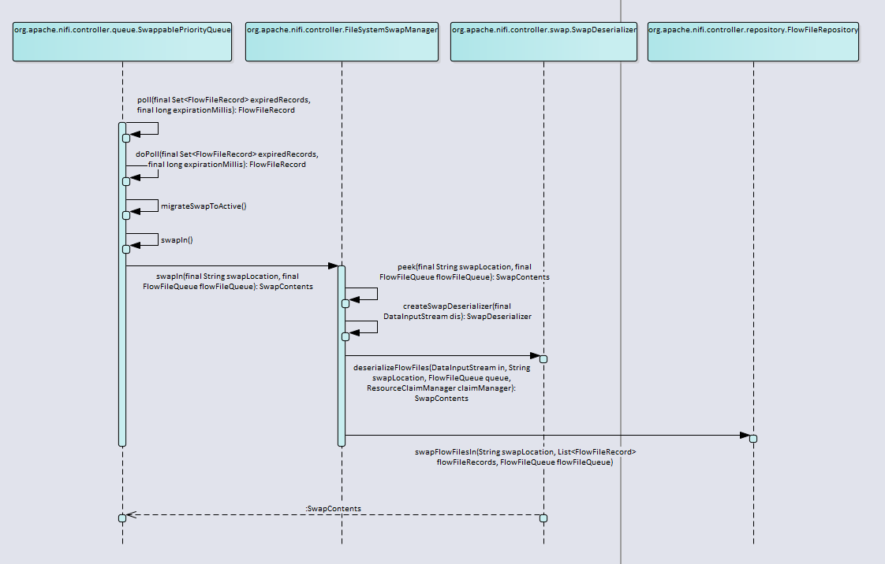
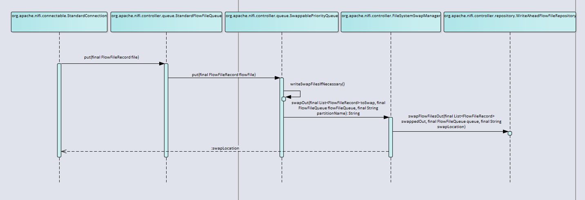

# FlowFile 的 swapIn 和 swapOut 过程

Processor通过ProcessSession获取FlowFile对象的过程会涉及内存和磁盘的IO交换，本质上是SwappablePriorityQueue类中的activeQueue、swapQueue和磁盘上的swap文件的交换过程，交换过程主要委派给FlowFileSwapManager。

## FlowFile swapIn过程



- 首先通过FlowFileSwapManager的swapIn方法获取待加载进内存的FlowFile集合。主要分为几个步骤：

> 1. 验证swap文件的合法性。
> 2. 通过peek方法读取磁盘上swap文件，并生成反序列化工具SwapDeserializer
> 3. 调用SwapDeserializer的deserializeFlowFiles方法，将swap文件中保存的FlowFile信息反序列化成对象。
> 4. 调用FlowFileRepository的swapFlowFilesIn方法将生成的FlowFile对象与所在FlowFileQueue关联，更新WAL，通知ContentRepository加载FlowFile对象的content，最后将swap文件从swap文件队列中清除，表示该swap文件已加载完毕。

``` Java
## org.apache.nifi.controller.FileSystemSwapManager

    @Override
    public SwapContents swapIn(final String swapLocation, final FlowFileQueue flowFileQueue) throws IOException {
        final File swapFile = new File(swapLocation);

        final boolean validLocation = flowFileRepository.isValidSwapLocationSuffix(swapFile.getName());
        if (!validLocation) {
            warn("Cannot swap in FlowFiles from location " + swapLocation + " because the FlowFile Repository does not know about this Swap Location. " +
                "This file should be manually removed. This typically occurs when a Swap File is written but the FlowFile Repository is not updated yet to reflect this. " +
                "This is generally not a cause for concern, but may be indicative of a failure to update the FlowFile Repository.");
            final SwapSummary swapSummary = new StandardSwapSummary(new QueueSize(0, 0), 0L, Collections.emptyList());
            return new StandardSwapContents(swapSummary, Collections.emptyList());
        }

        final SwapContents swapContents = peek(swapLocation, flowFileQueue);
        flowFileRepository.swapFlowFilesIn(swapFile.getAbsolutePath(), swapContents.getFlowFiles(), flowFileQueue);

        if (!swapFile.delete()) {
            warn("Swapped in FlowFiles from file " + swapFile.getAbsolutePath() + " but failed to delete the file; this file should be cleaned up manually");
        }

        return swapContents;
    }

    @Override
    public SwapContents peek(final String swapLocation, final FlowFileQueue flowFileQueue) throws IOException {
        final File swapFile = new File(swapLocation);
        if (!swapFile.exists()) {
            throw new FileNotFoundException("Failed to swap in FlowFiles from external storage location " + swapLocation + " into FlowFile Queue because the file could not be found");
        }

        try (final InputStream fis = new FileInputStream(swapFile);
                final InputStream bis = new BufferedInputStream(fis);
                final DataInputStream in = new DataInputStream(bis)) {

            final SwapDeserializer deserializer = createSwapDeserializer(in);
            return deserializer.deserializeFlowFiles(in, swapLocation, flowFileQueue, claimManager);
        }
    }

## org.apache.nifi.controller.repository.WriteAheadFlowFileRepository
    @Override
    public void swapFlowFilesIn(final String swapLocation, final List<FlowFileRecord> swapRecords, final FlowFileQueue queue) throws IOException {
        final List<RepositoryRecord> repoRecords = new ArrayList<>();

        for (final FlowFileRecord swapRecord : swapRecords) {
            final StandardRepositoryRecord repoRecord = new StandardRepositoryRecord(queue, swapRecord);
            repoRecord.setSwapLocation(swapLocation);   // set the swap file to indicate that it's being swapped in.
            repoRecord.setDestination(queue);

            repoRecords.add(repoRecord);
        }

        updateRepository(repoRecords, true);

        synchronized (this.swapLocationSuffixes) {
            this.swapLocationSuffixes.remove(normalizeSwapLocation(swapLocation));
        }

        logger.info("Repository updated to reflect that {} FlowFiles were swapped in to {}", new Object[]{swapRecords.size(), queue});
    }
```

- 加载FlowFile完毕后，根据返回的swapContents对象计算已加载的FlowFile个数及大小，并更新swapQueue。
- 特别的，如果在加载过程中捕获了**IncompleteSwapFileException**异常，需要重新计算实际加载的FlowFile个数及大小。
- 最终将FlowFile对象加入activeQueue中。

``` Java
## org.apache.nifi.controller.queue.SwappablePriorityQueue

private void swapIn() {
        final String swapLocation = swapLocations.get(0);
        boolean partialContents = false;
        SwapContents swapContents;
        try {
            logger.debug("Attempting to swap in {}; all swap locations = {}", swapLocation, swapLocations);
            swapContents = swapManager.swapIn(swapLocation, flowFileQueue);
            swapLocations.remove(0);
        } catch (final IncompleteSwapFileException isfe) {
            logger.error("Failed to swap in all FlowFiles from Swap File {}; Swap File ended prematurely. The records that were present will still be swapped in", swapLocation);
            logger.error("", isfe);
            swapContents = isfe.getPartialContents();
            partialContents = true;
            swapLocations.remove(0);
        } catch (final FileNotFoundException fnfe) {
            logger.error("Failed to swap in FlowFiles from Swap File {} because the Swap File can no longer be found", swapLocation);
            if (eventReporter != null) {
                eventReporter.reportEvent(Severity.ERROR, "Swap File", "Failed to swap in FlowFiles from Swap File " + swapLocation + " because the Swap File can no longer be found");
            }

            swapLocations.remove(0);
            return;
        } catch (final IOException ioe) {
            logger.error("Failed to swap in FlowFiles from Swap File {}; Swap File appears to be corrupt!", swapLocation);
            logger.error("", ioe);
            if (eventReporter != null) {
                eventReporter.reportEvent(Severity.ERROR, "Swap File", "Failed to swap in FlowFiles from Swap File " +
                    swapLocation + "; Swap File appears to be corrupt! Some FlowFiles in the queue may not be accessible. See logs for more information.");
            }

            // We do not remove the Swap File from swapLocations because the IOException may be recoverable later. For instance, the file may be on a network
            // drive and we may have connectivity problems, etc.
            return;
        } catch (final Throwable t) {
            logger.error("Failed to swap in FlowFiles from Swap File {}", swapLocation, t);

            // We do not remove the Swap File from swapLocations because this is an unexpected failure that may be retry-able. For example, if there were
            // an OOME, etc. then we don't want to he queue to still reflect that the data is around but never swap it in. By leaving the Swap File
            // in swapLocations, we will continue to retry.
            throw t;
        }

        final QueueSize swapSize = swapContents.getSummary().getQueueSize();
        final long contentSize = swapSize.getByteCount();
        final int flowFileCount = swapSize.getObjectCount();
        incrementSwapQueueSize(-flowFileCount, -contentSize, -1);

        if (partialContents) {
            // if we have partial results, we need to calculate the content size of the flowfiles
            // actually swapped back in.
            long contentSizeSwappedIn = 0L;
            for (final FlowFileRecord swappedIn : swapContents.getFlowFiles()) {
                contentSizeSwappedIn += swappedIn.getSize();
            }

            incrementActiveQueueSize(swapContents.getFlowFiles().size(), contentSizeSwappedIn);
            logger.debug("Swapped in partial contents containing {} FlowFiles ({} bytes) from {}", swapContents.getFlowFiles().size(), contentSizeSwappedIn, swapLocation);
        } else {
            // we swapped in the whole swap file. We can just use the info that we got from the summary.
            incrementActiveQueueSize(flowFileCount, contentSize);
            logger.debug("Successfully swapped in Swap File {} containing {} FlowFiles ({} bytes)", swapLocation, flowFileCount, contentSize);
        }

        activeQueue.addAll(swapContents.getFlowFiles());
    }
```

## FlowFile swapOut过程



FlowFile的swapOut过程发生在FlowFile对象添加到Processor间的连接队列时，主要可分成以下几个阶段：

- ProcessSession在commit过程中直接将FlowFile对象加入到FlowFileQueue队列中。

        ```Java
        ## org.apache.nifi.controller.repository.StandardProcessSession
            private void commit(final Checkpoint checkpoint) {
                ...
                // transfer the flowfiles to the connections' queues.
                final Map<FlowFileQueue, Collection<FlowFileRecord>> recordMap = new HashMap<>();
                for (final StandardRepositoryRecord record : checkpoint.records.values()) {
                    if (record.isMarkedForAbort() || record.isMarkedForDelete()) {
                        continue; // these don't need to be transferred
                    }
                    // record.getCurrent() will return null if this record was created in this session --
                    // in this case, we just ignore it, and it will be cleaned up by clearing the records map.
                    if (record.getCurrent() != null) {
                        Collection<FlowFileRecord> collection = recordMap.get(record.getDestination());
                        if (collection == null) {
                            collection = new ArrayList<>();
                            recordMap.put(record.getDestination(), collection);
                        }
                        collection.add(record.getCurrent());
                    }
                }
        
                for (final Map.Entry<FlowFileQueue, Collection<FlowFileRecord>> entry : recordMap.entrySet()) {
                    entry.getKey().putAll(entry.getValue()); // FlowFileQueue.putAll()
                }
                ...
            }
        
                    
        
        ## org.apache.nifi.controller.queue.StandardFlowFileQueue
            @Override
            public void put(final FlowFileRecord file) {
                queue.put(file);
        
                eventListener.triggerDestinationEvent();
            }
        
            @Override
            public void putAll(final Collection<FlowFileRecord> files) {
                queue.putAll(files);
        
                eventListener.triggerDestinationEvent();
            }
        ```

- FlowFile对象被添加到SwappablePriorityQueue中后，判断是否已到达swap阈值，如果没有到达则直接添加到activeQueue中；否则添加到swapQueue中，并决定是否需要swap到磁盘中。

``` Java
## org.apache.nifi.controller.queue.SwappablePriorityQueue

    public void put(final FlowFileRecord flowFile) {
        writeLock.lock();
        try {
            if (swapMode || activeQueue.size() >= swapThreshold) {
                swapQueue.add(flowFile);
                incrementSwapQueueSize(1, flowFile.getSize(), 0);
                swapMode = true;
                writeSwapFilesIfNecessary();
            } else {
                incrementActiveQueueSize(1, flowFile.getSize());
                activeQueue.add(flowFile);
            }

            logger.trace("{} put to {}", flowFile, this);
        } finally {
            writeLock.unlock("put(FlowFileRecord)");
        }
    }
```

- 在决定是否需要将FlowFile对象swap到磁盘的过程中，主要包含以下几个阶段：

> 1. 在将FlowFile对象从swapQueue队列转移回activeQueue前后两次判断swapQueue队列是否已达到swap阈值。
> 2. 以swap阈值（默认1w）为单位，划分swap文件。将swapQueue中的所有FlowFile添加到临时优先级队列tempQueue中。按照swap阈值大小从tempQueue中添加FlowFile对象，并按照优先级顺序组织待swapOut的FlowFile对象。
> 3. 调用FileSystemSwapManager的swapOut方法。该方法返回FlowFile对象flush到磁盘上的swap文件路径。在swapOut的过程中，可能会发生IO异常，则将swapOut失败的FlowFile对象添加回tempQueue中，并退出swapOut过程。
> 4. 无论swapOut过程是否成功，都将清空swapQueue，并将tempQueue中的FlowFile对象添加回swapQueue中，循环更新FlowFileQueueSize对象直至成功，并记录下本次成功swap到磁盘上生成的swap文件路径。

``` Java
    /**
     * This method MUST be called with the write lock held
     */
    private void writeSwapFilesIfNecessary() {
        if (swapQueue.size() < SWAP_RECORD_POLL_SIZE) {
            return;
        }

        migrateSwapToActive();
        if (swapQueue.size() < SWAP_RECORD_POLL_SIZE) {
            return;
        }

        final int numSwapFiles = swapQueue.size() / SWAP_RECORD_POLL_SIZE;

        int originalSwapQueueCount = swapQueue.size();
        long originalSwapQueueBytes = 0L;
        for (final FlowFileRecord flowFile : swapQueue) {
            originalSwapQueueBytes += flowFile.getSize();
        }

        // Create a new Priority queue with the same prioritizers that are set for this queue. We want to swap out the highest priority data first, because
        // whatever data we don't write out to a swap file (because there isn't enough to fill a swap file) will be added back to the swap queue.
        // Since the swap queue cannot be processed until all swap files, we want to ensure that only the lowest priority data goes back onto it. Which means
        // that we must swap out the highest priority data that is currently on the swap queue.
        final PriorityQueue<FlowFileRecord> tempQueue = new PriorityQueue<>(swapQueue.size(), new QueuePrioritizer(getPriorities()));
        tempQueue.addAll(swapQueue);

        long bytesSwappedOut = 0L;
        int flowFilesSwappedOut = 0;
        final List<String> swapLocations = new ArrayList<>(numSwapFiles);
        for (int i = 0; i < numSwapFiles; i++) {
            long bytesSwappedThisIteration = 0L;

            // Create a new swap file for the next SWAP_RECORD_POLL_SIZE records
            final List<FlowFileRecord> toSwap = new ArrayList<>(SWAP_RECORD_POLL_SIZE);
            for (int j = 0; j < SWAP_RECORD_POLL_SIZE; j++) {
                final FlowFileRecord flowFile = tempQueue.poll();
                toSwap.add(flowFile);
                bytesSwappedThisIteration += flowFile.getSize();
            }

            try {
                Collections.reverse(toSwap); // currently ordered in reverse priority order based on the ordering of the temp queue.
                final String swapLocation = swapManager.swapOut(toSwap, flowFileQueue, swapPartitionName);
                swapLocations.add(swapLocation);

                logger.debug("Successfully wrote out Swap File {} containing {} FlowFiles ({} bytes)", swapLocation, toSwap.size(), bytesSwappedThisIteration);

                bytesSwappedOut += bytesSwappedThisIteration;
                flowFilesSwappedOut += toSwap.size();
            } catch (final IOException ioe) {
                tempQueue.addAll(toSwap); // if we failed, we must add the FlowFiles back to the queue.

                final int objectCount = getFlowFileCount();
                logger.error("FlowFile Queue with identifier {} has {} FlowFiles queued up. Attempted to spill FlowFile information over to disk in order to avoid exhausting "
                    + "the Java heap space but failed to write information to disk due to {}", getQueueIdentifier(), objectCount, ioe.toString());
                logger.error("", ioe);
                if (eventReporter != null) {
                    eventReporter.reportEvent(Severity.ERROR, "Failed to Overflow to Disk", "Flowfile Queue with identifier " + getQueueIdentifier() + " has " + objectCount +
                        " queued up. Attempted to spill FlowFile information over to disk in order to avoid exhausting the Java heap space but failed to write information to disk. "
                        + "See logs for more information.");
                }

                break;
            }
        }

        // Pull any records off of the temp queue that won't fit back on the active queue, and add those to the
        // swap queue. Then add the records back to the active queue.
        swapQueue.clear();
        long updatedSwapQueueBytes = 0L;
        FlowFileRecord record;
        while ((record = tempQueue.poll()) != null) {
            swapQueue.add(record);
            updatedSwapQueueBytes += record.getSize();
        }

        Collections.reverse(swapQueue); // currently ordered in reverse priority order based on the ordering of the temp queue

        boolean updated = false;
        while (!updated) {
            final FlowFileQueueSize originalSize = getFlowFileQueueSize();

            final int addedSwapRecords = swapQueue.size() - originalSwapQueueCount;
            final long addedSwapBytes = updatedSwapQueueBytes - originalSwapQueueBytes;

            final FlowFileQueueSize newSize = new FlowFileQueueSize(originalSize.getActiveCount(), originalSize.getActiveBytes(),
                originalSize.getSwappedCount() + addedSwapRecords + flowFilesSwappedOut,
                originalSize.getSwappedBytes() + addedSwapBytes + bytesSwappedOut,
                originalSize.getSwapFileCount() + numSwapFiles,
                originalSize.getUnacknowledgedCount(), originalSize.getUnacknowledgedBytes());

            updated = updateSize(originalSize, newSize);
            if (updated) {
                logIfNegative(originalSize, newSize, "swap");
            }
        }

        this.swapLocations.addAll(swapLocations);
        logger.debug("After writing swap files, setting new set of Swap Locations to {}", this.swapLocations);
    }
```

- 特别说明下，FileSystemSwapManager的swapOut方法。

> 1. swap文件命名样式：\${绝对时间秒数}-\${flowFileQueue的id}-\${UUID}-${partitionNum}.swap。
> 2. 在flush到磁盘的过程中，会先写中间文件“*.part”，成功后再rename，并返回swap文件路径。

``` Java
## org.apache.nifi.controller.FileSystemSwapManager

    @Override
    public String swapOut(final List<FlowFileRecord> toSwap, final FlowFileQueue flowFileQueue, final String partitionName) throws IOException {
        if (toSwap == null || toSwap.isEmpty()) {
            return null;
        }

        final String swapFilePrefix = System.currentTimeMillis() + "-" + flowFileQueue.getIdentifier() + "-" + UUID.randomUUID().toString();
        final String swapFileBaseName = partitionName == null ? swapFilePrefix : swapFilePrefix + "." + partitionName;
        final String swapFileName = swapFileBaseName + ".swap";

        final File swapFile = new File(storageDirectory, swapFileName);
        final File swapTempFile = new File(swapFile.getParentFile(), swapFile.getName() + ".part");
        final String swapLocation = swapFile.getAbsolutePath();

        final SwapSerializer serializer = new SchemaSwapSerializer();
        try (final FileOutputStream fos = new FileOutputStream(swapTempFile);
            final OutputStream out = new BufferedOutputStream(fos)) {
            out.write(MAGIC_HEADER);
            final DataOutputStream dos = new DataOutputStream(out);
            dos.writeUTF(serializer.getSerializationName());

            serializer.serializeFlowFiles(toSwap, flowFileQueue, swapLocation, out);
            fos.getFD().sync();
        } catch (final IOException ioe) {
            // we failed to write out the entire swap file. Delete the temporary file, if we can.
            swapTempFile.delete();
            throw ioe;
        }

        if (swapTempFile.renameTo(swapFile)) {
            flowFileRepository.swapFlowFilesOut(toSwap, flowFileQueue, swapLocation);
        } else {
            error("Failed to swap out FlowFiles from " + flowFileQueue + " due to: Unable to rename swap file from " + swapTempFile + " to " + swapFile);
        }

        return swapLocation;
    }
```

- 调用FlowFileRepository的swapFlowFilesOut方法。

> 1. 记录FlowFile的Update Type、FlowFile ID、swap文件路径和Queue ID.
> 2. 更新WAL。
> 3. 登记swap文件路径。

``` Java
## org.apache.nifi.controller.repository.WriteAheadFlowFileRepository
    /**
     * Swaps the FlowFiles that live on the given Connection out to disk, using
     * the specified Swap File and returns the number of FlowFiles that were
     * persisted.
     *
     * @param queue        queue to swap out
     * @param swapLocation location to swap to
     * @throws IOException ioe
     */
    @Override
    public void swapFlowFilesOut(final List<FlowFileRecord> swappedOut, final FlowFileQueue queue, final String swapLocation) throws IOException {
        final List<RepositoryRecord> repoRecords = new ArrayList<>();
        if (swappedOut == null || swappedOut.isEmpty()) {
            return;
        }

        for (final FlowFileRecord swapRecord : swappedOut) {
            final RepositoryRecord repoRecord = new StandardRepositoryRecord(queue, swapRecord, swapLocation);
            repoRecords.add(repoRecord);
        }

        // TODO: We should probably update this to support bulk 'SWAP OUT' records. As-is, we have to write out a
        // 'SWAP OUT' record for each FlowFile, which includes the Update Type, FlowFile ID, swap file location, and Queue ID.
        // We could instead have a single record with Update Type of 'SWAP OUT' and just include swap file location, Queue ID,
        // and all FlowFile ID's.
        // update WALI to indicate that the records were swapped out.
        wal.update(repoRecords, true);

        synchronized (this.swapLocationSuffixes) {
            this.swapLocationSuffixes.add(normalizeSwapLocation(swapLocation));
        }

        logger.info("Successfully swapped out {} FlowFiles from {} to Swap File {}", swappedOut.size(), queue, swapLocation);
    }
```

## swap文件格式

- swap文件内容共分为四个部分

> 1. 魔数(byte[] MAGIC_HEADER = {'S', 'W', 'A', 'P'})
> 2. 序列化器名称："Schema Swap Serialization"
> 3. schema
> 4. schema对应的摘要信息、FlowFile内容

``` yaml
## schema

FULL_SWAP_FILE_SCHEMA_V2
    SWAP_SUMMARY(complex, 1)
        QUEUE_IDENTIFIER(string, 1)
        FLOWFILE_COUNT(int, 1)
        FLOWFILE_SIZE(long, 1)
        MAX_RECORD_ID(long, 1)
        RESOURCE_CLAIMS(map, 1)
            RESOURCE_CLAIM(complex, 1)
                CLAIM_CONTAINER(string, 1)
                CLAIM_SECTION(string, 1)
                CLAIM_IDENTIFIER(string, 1)
                LOSS_TOLERANT(boolean, 1)
            RESOURCE_CLAIM_COUNT(int ,1)
    FLOWFILE_CONTENTS(complex, >0)
        RECORD_ID(long, 1)
        ENTRY_DATE(long, 1)
        LINEAGE_START_DATE(long, 1)
        LINEAGE_START_INDEX(long, 1)
        QUEUE_DATE(long, 1)
        QUEUE_DATE_INDEX(long, 1)
        FLOWFILE_SIZE(long, 1)
        CONTENT_CLAIM(complex, >0)
            RESOURCE_CLAIM(complex, 1)
                CLAIM_CONTAINER(string, 1)
                CLAIM_SECTION(string, 1)
                CLAIM_IDENTIFIER(string, 1)
                LOSS_TOLERANT(boolean, 1)
            RESOURCE_CLAIM_OFFSET(long, 1)
            CONTENT_CLAIM_OFFSET(long, 1)
            CONTENT_CLAIM_LENGTH(long, 1)
        ATTRIBUTES
            ATTRIBUTE_NAME(long-string(4 bytes), 1)
            ATTRIBUTE_VALUE(long-string(4 bytes), 1)
```